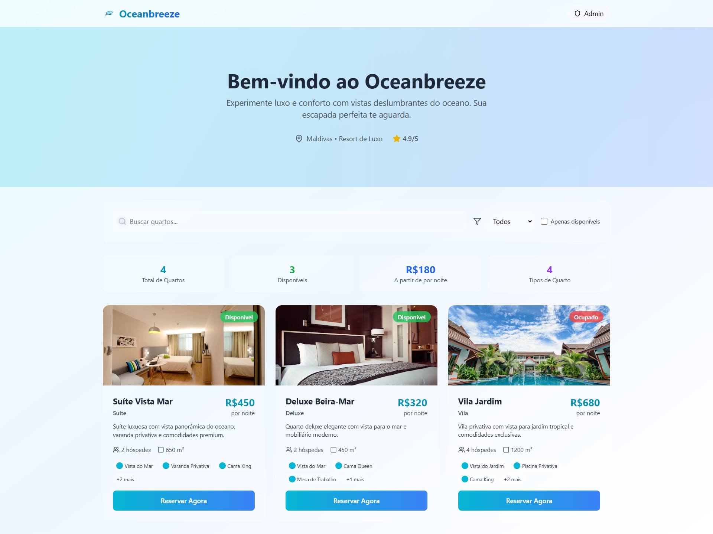

<div align="center">

# Ocean Breeze


### Sistema de Gerenciamento de Quartos de Hotel


</div>

---

## ✨ Visão Geral

O **Ocean Breeze** é um sistema CRUD (Create, Read, Update, Delete) para gerenciamento de quartos de um hotel fictício, desenvolvido para fins de estudo e prática de desenvolvimento web. A aplicação permite visualizar, adicionar, editar e excluir informações sobre os quartos do hotel, com uma interface de usuário moderna e responsiva.

<div align="center">
  
  <p><em>Interface intuitiva e elegante de quartos</em></p>
</div>

## 🌟 Funcionalidades

### 🏨 Área Pública

- **Visualização de Quartos**: Exibição de todos os quartos disponíveis
- **Filtragem Avançada**: Busca por disponibilidade
- **Detalhes Completos**: Visualização de preços, comodidades e características dos quartos
- **Autenticação**: Sistema de login e registro para clientes
- **Reserva de Quartos**: Clientes podem reservar quartos para datas específicas
- **Avaliações e Comentários**: Clientes podem deixar comentários e avaliações sobre os quartos
- **Perfil do Usuário**: Gerenciamento de perfil e visualização de reservas
- **Interface Responsiva**: Experiência otimizada em dispositivos móveis e desktop

### 👩‍💼 Área Administrativa

- **Dashboard Completo**: Estatísticas e visão geral dos quartos
- **Gerenciamento de Quartos**: Adicionar, editar e remover quartos
- **Controle de Disponibilidade**: Marcar quartos como disponíveis ou ocupados
- **Autenticação**: Sistema de login para acesso à área administrativa e reservas

## 🛠️ Tecnologias Utilizadas

### Frontend

- **React**: Biblioteca JavaScript para construção de interfaces
- **TypeScript**: Superset tipado de JavaScript
- **Tailwind CSS**: Framework CSS utilitário para design responsivo
- **Lucide React**: Biblioteca de ícones modernos
- **Vite**: Build tool e servidor de desenvolvimento

### Armazenamento

- **LocalStorage**: Persistência de dados no navegador

## 🚀 Como Executar

### Pré-requisitos

- Node.js (versão 16 ou superior)
- npm ou yarn

### Passos para Execução

1. **Clone o repositório**

   ```bash
   git clone https://github.com/pedronicolasg/oceanbreeze.git
   cd oceanbreeze
   ```

2. **Instale as dependências**

   ```bash
   npm install
   # ou
   yarn
   ```

3. **Inicie o servidor de desenvolvimento**

   ```bash
   npm run dev
   # ou
   yarn dev
   ```

4. **Acesse a aplicação**
   - Abra seu navegador e acesse: `http://localhost:5173`

## 📁 Estrutura do Projeto

```
ocean-breeze/
├── public/                          # Arquivos públicos estáticos
│   ├── logo.png                     # Logo do Ocean Breeze
│   └── screenshot.png               # Screenshot da aplicação
│
├── src/                             # Código fonte da aplicação
    ├── App.tsx                      # Componente principal
    ├── index.css                    # Estilos principais
    ├── main.tsx                     # Ponto de entrada da aplicação
    ├── vite-env.d.ts
    │
    ├── components/                  # Componentes reutilizáveis
    │   ├── Layout/                  # Componentes de layout
    │   │   ├── Footer.tsx           # Rodapé da aplicação
    │   │   └── Header.tsx           # Cabeçalho principal
    │   │
    │   └── UI/                      # Componentes de interface
    │       ├── DatePicker.tsx       # Seletor de data
    │       ├── ImageUpload.tsx      # Upload de imagens
    │       ├── LoadingSpinner.tsx   # Indicador de carregamento
    │       └── Modal.tsx            # Modal genérico
    │
    ├── contexts/                    # Contextos do React
    │   ├── AuthContext.tsx          # Contexto de autenticação
    │   ├── BookingContext.tsx       # Contexto de reservas
    │   └── ThemeContext.tsx         # Contexto de tema
    │
    ├── pages/                       # Páginas da aplicação
    │   ├── Admin.tsx                # Página administrativa
    │   ├── Home.tsx                 # Página inicial
    │   ├── Login.tsx                # Página de login
    │   ├── Profile.tsx              # Perfil do usuário
    │   ├── Register.tsx             # Página de registro
    │   ├── Reservations.tsx         # Reservas do usuário
    │   └── RoomDetails.tsx          # Detalhes do quarto
    │
    └── types/                       # Definições de tipos TypeScript
        └── index.ts                 # Tipos principais
│
├── eslint.config.js                 # Configuração do ESLint
├── index.html                       # Template HTML principal
├── LICENSE                          # Licença MIT
├── package.json                     # Dependências e scripts
├── postcss.config.js                # Configuração do PostCSS
├── tailwind.config.js               # Configuração do Tailwind CSS
├── tsconfig.app.json                # Config TypeScript para aplicação
├── tsconfig.json                    # Config principal do TypeScript
├── tsconfig.node.json               # Config TypeScript para Node.js
└── vite.config.ts                   # Configuração do Vite
```

## 🎨 Design e UI/UX

O projeto utiliza uma paleta de cores inspirada no oceano, com tema dark, gradientes suaves e efeitos de vidro (glassmorphism) para criar uma experiência visual agradável e moderna. A interface é intuitiva e fácil de usar, com foco na experiência do usuário.

## 🧪 Desenvolvimento

Este projeto foi desenvolvido como exercício prático para aplicar conceitos de:

- Desenvolvimento de interfaces com React e TypeScript
- Gerenciamento de estado em aplicações React
- Criação de interfaces responsivas com Tailwind CSS
- Implementação de operações CRUD
- Persistência de dados com LocalStorage

## 👥 Devs

<table>
  <tr>
    <td align="center">
      <a href="https://github.com/pedronicolasg">
        <br>
        <sub>
          <b>Pedro Nícolas Gomes de Souza</b>
        </sub>
      </a>
    </td>
    <td align="center">
      <a href="https://github.com/AnaCristinasnts">
        <br>
        <sub>
          <b>Ana Cristina Silva dos Santos</b>
        </sub>
      </a>
    </td>
  </tr>
</table>

## 📄 Licença

Este projeto está sob a licença MIT. Veja o arquivo [LICENSE](LICENSE) para mais detalhes.

---

<div align="center">
  <p>Desenvolvido com 💙 para fins educacionais</p>
</div>