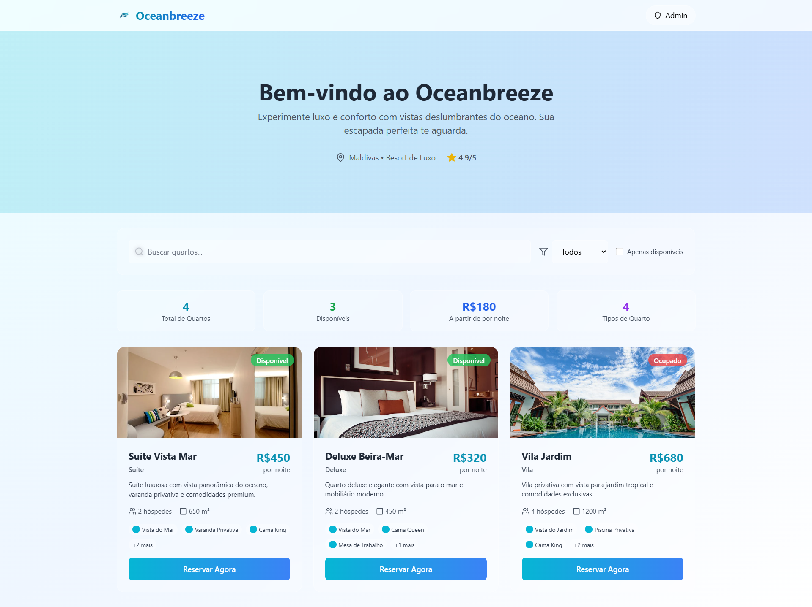

<div align="center">

# OceanBreeze


### Sistema de Gerenciamento de Quartos de Hotel

[](https://reactjs.org/) [](https://www.typescriptlang.org/) [](https://tailwindcss.com/) [](https://vitejs.dev/)

</div>

---

## ✨ Visão Geral

O **Ocean Breeze** é um sistema CRUD (Create, Read, Update, Delete) para gerenciamento de quartos de um hotel fictício, desenvolvido para fins de estudo e prática de desenvolvimento web. A aplicação permite visualizar, adicionar, editar e excluir informações sobre os quartos do hotel, com uma interface de usuário moderna e responsiva.

<div align="center">
  
  <p><em>Interface intuitiva e elegante de quartos</em></p>
</div>

## 🌟 Funcionalidades

### 🏨 Área Pública
- **Visualização de Quartos**: Exibição de todos os quartos disponíveis
- **Filtragem Avançada**: Busca por nome, tipo de quarto e disponibilidade
- **Detalhes Completos**: Visualização de preços, comodidades e características dos quartos
- **Interface Responsiva**: Experiência otimizada em dispositivos móveis e desktop

### 👩‍💼 Área Administrativa
- **Dashboard Completo**: Estatísticas e visão geral dos quartos
- **Gerenciamento de Quartos**: Adicionar, editar e remover quartos
- **Controle de Disponibilidade**: Marcar quartos como disponíveis ou ocupados
- **Autenticação**: Sistema de login para acesso à área administrativa

## 🛠️ Tecnologias Utilizadas

### Frontend
- **React**: Biblioteca JavaScript para construção de interfaces
- **TypeScript**: Superset tipado de JavaScript
- **Tailwind CSS**: Framework CSS utilitário para design responsivo
- **Lucide React**: Biblioteca de ícones modernos
- **Vite**: Build tool e servidor de desenvolvimento

### Armazenamento
- **LocalStorage**: Persistência de dados no navegador

## 🚀 Como Executar

### Pré-requisitos
- Node.js (versão 16 ou superior)
- npm ou yarn

### Passos para Execução

1. **Clone o repositório**
   ```bash
   git clone https://github.com/pedronicolasg/oceanbreeze.git
   cd oceanbreeze
   ```

2. **Instale as dependências**
   ```bash
   npm install
   # ou
   yarn
   ```

3. **Inicie o servidor de desenvolvimento**
   ```bash
   npm run dev
   # ou
   yarn dev
   ```

4. **Acesse a aplicação**
   - Abra seu navegador e acesse: `http://localhost:5173`

## 📁 Estrutura do Projeto

```
├── public/                # Arquivos públicos
│   ├── logo.png           # Logo do projeto
│   └── screenshot.png     # Demo do projeto
├── src/                   # Código-fonte
│   ├── components/        # Componentes React
│   │   ├── AdminDashboard.tsx  # Dashboard administrativo
│   │   ├── Header.tsx     # Cabeçalho da aplicação
│   │   ├── LoginPage.tsx  # Página de login
│   │   ├── PublicPage.tsx # Página pública
│   │   ├── RoomCard.tsx   # Card de quarto
│   │   └── RoomForm.tsx   # Formulário de quarto
│   ├── types/             # Definições de tipos TypeScript
│   ├── utils/             # Utilitários
│   │   └── storage.ts     # Funções de armazenamento
│   ├── App.tsx           # Componente principal
│   ├── index.css         # Estilos globais
│   └── main.tsx          # Ponto de entrada
├── index.html            # HTML principal
├── package.json          # Dependências e scripts
├── tailwind.config.js    # Configuração do Tailwind CSS
├── tsconfig.json         # Configuração do TypeScript
└── vite.config.ts        # Configuração do Vite
```

## 🔐 Autenticação

Para acessar a área administrativa, utilize as seguintes credenciais:

- **Usuário**: admin
- **Senha**: rosenildobrabo123

## 🎨 Design e UI/UX

O projeto utiliza uma paleta de cores inspirada no oceano, com gradientes suaves e efeitos de vidro (glassmorphism) para criar uma experiência visual agradável e moderna. A interface é intuitiva e fácil de usar, com foco na experiência do usuário.

## 🧪 Desenvolvimento

Este projeto foi desenvolvido como exercício prático para aplicar conceitos de:
- Desenvolvimento de interfaces com React e TypeScript
- Gerenciamento de estado em aplicações React
- Criação de interfaces responsivas com Tailwind CSS
- Implementação de operações CRUD
- Persistência de dados com LocalStorage

## 👥 Autores

<table>
  <tr>
    <td align="center">
      <a href="https://github.com/pedronicolasg">
        <br>
        <sub>
          <b>Pedro Nícolas Gomes de Souza</b>
        </sub>
      </a>
    </td>
    <td align="center">
      <a href="https://github.com/AnaCristinasnts">
        <br>
        <sub>
          <b>Ana Cristina Silva dos Santos</b>
        </sub>
      </a>
    </td>
  </tr>
</table>

## 📄 Licença

Este projeto está sob a licença MIT. Veja o arquivo [LICENSE](LICENSE) para mais detalhes.

---

<div align="center">
  <p>Desenvolvido com 💙 para fins educacionais</p>
</div>